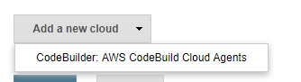
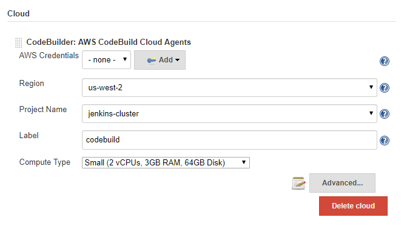

# CodeBuilder Plugin for Jenkins

This Jenkins plugin dynamically spins up cloud agents using AWS CodeBuild to
execute jobs as Jenkins builds.

This means that instead of using an AWS CodeBuild `buildspec.yml` file, the job
will be configured and managed by Jenkins. Steps can be configured directly in
the Jenkins UI as normal, and pipelines can continue make use of the
`Jenkinsfile` with no need to migrate configuration.

Effectively, this plugin is a full drop-in replacement to any other node
provider.

## Plugin Installation

This plugin artifact ID is `codebuilder-cloud` but has yet to be made available
to the Jenkins plugin repository.

The best way to install this now is to grab the `codebuilder-cloud.hpi`
artifact from Releases and place the file in `JENKINS_HOME/plugins` (where
JENKINS_HOME is the location on disk where Jenkins configuration lives)
and dependencies listed below.

### Compatibility and Requirements

This plugin depends on `aws-java-sdk@1.11.341` and `aws-credentials@1.23` and is
compatible with Jenkins 1.651.3+.

## Usage

Because permission management can be difficult, this plugin assumes you have
created an AWS CodeBuild project with the necessary IAM roles for the job
types that you will be running. The project can have any configuration; all
settings will be overridden by the plugin to provide a build using source
provided by the Jenkins host.

Once a project is created, you can configure the cloud in Jenkins by adding
a new cloud and configuring the plugin in `Manage Jenkins > Configure System`.
After this, builds that match the cloud label will automatically be provisioned
through AWS CodeBuild.

### Quick Start

#### Creating an AWS CodeBuild Project (Optional)

If you have already setup a project, you can skip this step. Otherwise, if you
want a quick way to bootstrap configuration, you can use the [AWS CLI][awscli]
to create an AWS CodeBuild project with bare permissions by running the
commands below:

```sh
# Optional command to create a bare IAM role named "jenkins-default"
aws iam create-role \
  --role-name jenkins-default \
  --assume-role-policy-document \
  '{"Version":"2012-10-17 ","Statement":[{"Effect": "Allow","Principal":{"Service":"codebuild.amazonaws.com"},"Action":"sts:AssumeRole"}]}'

# Create the project named "jenkins-cluster" using our service role
aws codebuild create-project \
  --name jenkins-cluster \
  --service-role jenkins-default \
  --artifacts type=NO_ARTIFACTS \
  --environment type=LINUX_CONTAINER,image=aws/codebuild/docker:18.09.0,computeType=BUILD_GENERAL1_SMALL \
  --source $'type=NO_SOURCE,buildspec=version:0.2\nphases:\n  build:\n    commands:\n      - exit 1'
```

#### Configuring the Plugin

In `Manage Jenkins > Configure System` you will find a drop-down to "Add a New
Cloud":



After adding the cloud, you can configure the region, project name, and
other basic build agent details. Only region and project name are required.
Credentials can be sourced from your `~/.aws/credentials` file or
`AWS_ACCESS_KEY_ID` and `AWS_SECRET_ACCESS_KEY` environment variables if left
blank.

Your configuration might look something like this:



And that's it, you're all set to trigger new builds on AWS CodeBuild!

## Configuring Builds with Default JNLP Image

The base image of `lsegal/jnlp-docker-image:alpine` provides a base Alpine
install with `docker`, and `git`, and Java 8. It is recommended to rely on
Docker images for building when possible. A `Jenkinsfile` example of this would
be:

```groovy
pipeline {
  agent {
    label 'codebuilder'
    docker { image 'node:7-alpine' }
  }
  stages {
    stage('Build') {
      steps {
        sh 'node --version'
      }
    }
  }
}
```

If you would prefer to install software directly, you can do using your `root`
privileges on the machine (builds are by default run as a root user):

```groovy
pipeline {
  agent { label 'codebuilder' }
  stages {
    stage('Install') {
      steps { sh 'apk add -U nodejs' }
    }
    stage('Build') {
      steps { sh 'node --version' }
    }
  }
}
```

Performing package installs can be slow, so to speed up and take advantage
of CodeBuild caching you may want to create a custom image that contains
the necessary software tooling. This is described in the next section.

## Creating a Custom JNLP Docker Image

The Docker image that configures agents can be customized to contain other
build environment tools if needed. To do this, you must create a Docker image
with a `jenkins-agent` binary that can spawn the [Jenkins Remoting library][remoting]
and passes arguments over to that jar.

Optionally you can also provide a `dockerd-entrypoint.sh` executable in the
PATH that spins up a Docker daemon for supporting `docker run` in the instance.

The easiest way to set this up is to create a `Dockerfile` that relies on the pre-existing base image
`lsegal/jnlp-docker-agent:alpine`, installing all software there:

```dockerfile
FROM lsegal/jnlp-docker-agent:alpine
RUN apk add -U ruby
```

Run `docker build -t myname/myimage .` to build this image and publish it to
your favorite Docker registry. You can now customize the `jnlpImage`
configuration option with `myname/myimage` to run builds with extra software
pre-installed.

## Programmatic Configuration with Groovy

You can automatically configure the CodeBuilder cloud with Groovy init scripts
by adding a `codebuilder.groovy` to `JENKINS_HOME/init.groovy.d`:

```groovy
import dev.lsegal.jenkins.codebuilder.CodeBuilderCloud
import jenkins.model.Jenkins

credentialsId = null                         // IAM profile or credentials file
region        = System.getenv("AWS_REGION")  // the region for the project
projectName   = "jenkins-cluster"            // the name of the project
label         = "codebuild"                  // set a label to limit builds
jenkinsUrl    = null                         // use default Jenkins URL for JNLP
jnlpImage     = null                         // use default JNLP Docker image
computeType   = "BUILD_GENERAL1_SMALL"       // use a small build instance

// Remove previous cloud instances
jenkins = Jenkins.getInstance()
prevInstances = jenkins.clouds.findAll { c -> c instanceof CodeBuilderCloud }
jenkins.clouds.removeAll(prevInstances)

// Re-add this cloud
cbc = new CodeBuilderCloud(null, projectName, credentialsId, region)
cbc.setLabel(label)
cbc.setJenkinsUrl(jenkinsUrl)
cbc.setJnlpImage(jnlpImage)
cbc.setComputeType(computeType)

jenkins.clouds.add(cbc);
jenkins.save()
```

## FAQ

### 1. Why not use the [Amazon ECS Plugin][ecsplugin]?

The Amazon ECS plugin can also provision on-demand nodes, and that can be
useful in certain cases, however the ECS plugin introduces significantly
more complexity in the configuration of these nodes, and provisioning
nodes is not always as fast with cold-starts from Fargate. AWS CodeBuild
provides a very similar on-demand provisioning scheme to Fargate, but also
allows for some nice features such as Docker image caching, in addition to
other temporal locally cached assets.

For jobs that are expected to be provisioned independently and run repeatedly
but for a relatively short amount of time, AWS CodeBuild has a good matching
set of features to support these types of builds with much less configuring
than manually provisioned Amazon ECS clusters.

### 2. Why not use Jenkins support in AWS CodeBuild?

AWS CodeBuild has official support for [using Jenkins hosts as a source][awsjenkins]
for builds, and even has [a Jenkins plugin][awsjenkinsplugin] that enables
sending Jenkins jobs to CodeBuild in a very similar way to this plugin.

The big difference between these two plugins is that the AWS plugin uses AWS
CodeBuild as the source of truth for builds, rather than Jenkins. In practice,
this means that project sources will need to use `buildspec.yml` files to
define steps, as well as explicitly define build steps in Jenkins jobs to send
work to AWS CodeBuild. This requires the migration of job configuration,
as well as extra AWS resources (S3 buckets in particular) to pass source code
to AWS CodeBuild. With that plugin, AWS CodeBuild is the tool that actually
manages source, environments, secrets, and all build logic for the job;
Jenkins only acts as a trigger.

On the other hand, this plugin keeps Jenkins as the source of truth, ensuring
that all configuration, logging, and state management remains inside of Jenkins
itself in order to provide a transparent transition to running builds on AWS
CodeBuild. This plugin is primarily aimed at environments that rely on Jenkins
as a primary build management tool. The AWS plugin might be better suited for
use cases where builds are primarily logged in AWS CodeBuild.

## License

This project &copy; 2019 by [Loren Segal](mailto:lsegal@soen.ca) and is
licensed under the MIT license.

[ecsplugin]: https://plugins.jenkins.io/amazon-ecs
[awsjenkins]: https://docs.aws.amazon.com/codebuild/latest/userguide/jenkins-plugin.html
[awsjenkinsplugin]: https://github.com/awslabs/aws-codebuild-jenkins-plugin
[awscli]: https://docs.aws.amazon.com/cli/latest/userguide/cli-chap-install.html
[remoting]: https://jenkins.io/projects/remoting/
